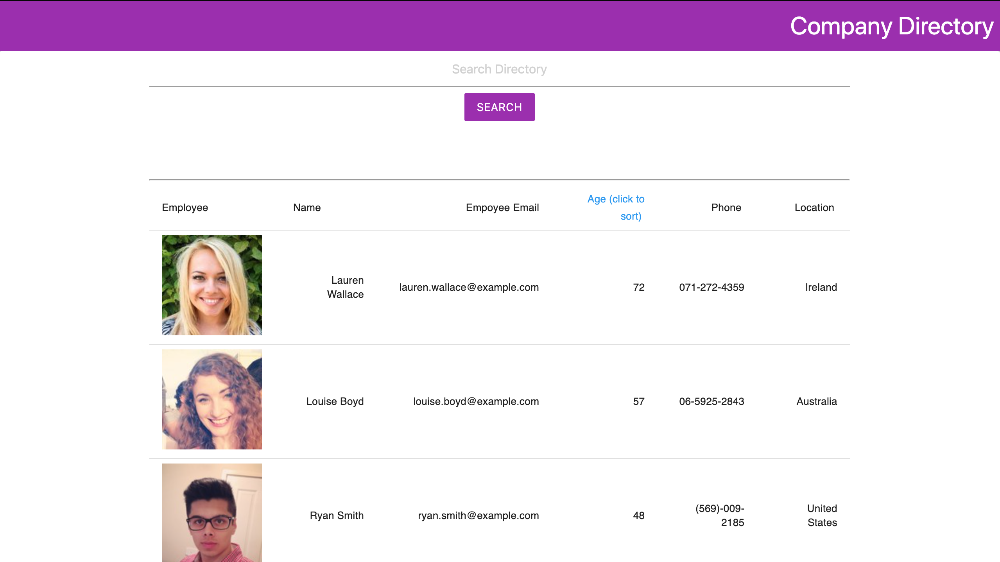

# Company-Directory

## Table of Contents
 1. [Description](#Description)
 2. [Usage](#Usage)
 3. [Contributing](#Contributing)
 4. [Tests](#Tests)
 5. [Questions](#Questions)
 6. [License](#License)
## Description
This Application allows useres to navigate through a directory by age and by name through a serach bar function. Check out the full site here: https://ianfletcher314.github.io/company-directory/

## Usage
This project React JS, Random User API, Materialize, and Material UI

## Contributing
Ian Fletcher developed this application 

## Questions 
Please contact me at ianfletcher314@gmail.com or visit my GitHub github.com/ianfletcher314

## License
This application is protected under the MIT license
  
